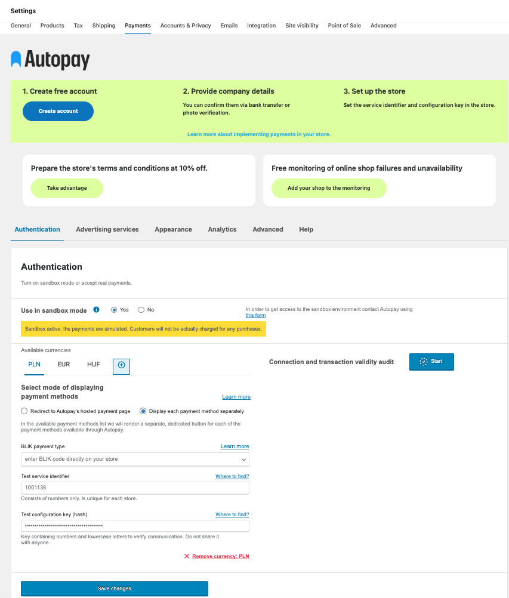

# Instructions for WooCommerce plug-in: Autopay payment gateway

## Basic information

Autopay is a payment module that enables cashless transactions in a shop based on the WordPress platform (WooCommerce). If you do not already have the plugin, you can download it [here](https://github.com/bluepayment-plugin/autopay-payments/releases).

## What does the Autopay payment plugin offer?

The Autopay payment plugin offers a range of functionalities to support sales on your shop:
- The most popular payment methods in Poland and Europe
	- Online transfers ([Pay By Link](https://autopay.pl/baza-wiedzy/blog/ecommerce/platnosc-pay-by-link-na-czym-polega-i-co-mozesz-dzieki-niej-zyskac))
	- Fast bank transfers
	- [BLIK](https://autopay.pl/rozwiazania/blik)
	- Visa Mobile
	- [Google Pay](https://autopay.pl/rozwiazania/google-pay)
	- [Apple Pay](https://autopay.pl/rozwiazania/apple-pay)
	- Instalment payments
	- Recurring payments
	- International payments
- The most popular sales methods for the WooCommerce platform
- buy as a guest / buy as a registered user
- step checkout or block checkout
- payment processing with redirection to an external payment page or remaining directly on the shop (selected methods: cards, BLIK)
- test environment support (implementation of test transactions for correct installation and configuration of the plug-in)
- deferred and instalment payments
- native integration into Google Analytics 4 from within the Autopay payment plug-in
- automatic verification of the correct configuration of authorization data in the plug-in
- multilingual support – automatic adaptation to the store language (EN,
  DE, IT, ES); for other languages, the interface is displayed in English
- ability to manually change the order of Autopay payment methods in the
  WooCommerce panel using drag & drop

[Register your shop!](https://autopay.pl/oferta/platnosci-online?utm_campaign=woocommerce&utm_source=woocommerce_description&utm_medium=offer_cta#kalkulator)

## Installation

### Requirements for installing the plug-in

- WordPress - tested on versions `6.0` to `6.9`
- WooCommerce plugin - tested on versions `7.9.0` to `10.4.3`
- PHP version min. `7.4`

### Download from wordpress.org

The [Wordpress](https://pl.wordpress.org/plugins/platnosci-online-blue-media/) platform brings together various types of extensions compatible with sites built on WordPress / WooCommerce.
In the case of the Autopay payment plugin, various (official and unofficial) plugin versions are available at [https://wordpress.org](https://wordpress.org). You can find the latest version of the plugin created directly by Autopay at [wordpress marketplace](https://pl.wordpress.org/plugins/platnosci-online-blue-media/).

## Configure the plugin
Log in to the dashboard and go to the **Payments** tab and find the **Autopay** method. Select **Configure** to start configuring the plugin. Or select the appropriate option on the toggle to **enable** / **disable** the operation of the plugin on your shop.

If you encountered a problem while installing the plugin, visit our [FAQ section.](https://developers.autopay.pl/online/wtyczki/woocommerce#najcz%C4%99%C5%9Bciej-zadawane-pytania)

### Authentication

The ‘Authentication’ tab will allow you to enter your Autopay account credentials into the plugin, as well as determine whether you want Autopay payments to work on a test or production environment.
1. **Test environment**.
	- set to **yes** - This is used to test the integration and configuration of the Autopay plugin on your shop. In the test environment, the payer will not be charged for any purchases and you will not receive payment for any sales. Transactions will only be virtual. Remember never to send transactions for transactions paid in test mode!
	- set to **no** - The plugin runs on a production environment. In other words, transactions and payments are really happening. The payer is financially charged for the purchase and the merchant receives funds from Autopay for the sales made.
2. **Service ID** - This is the ID of your Autopay account. You will find it when you log into your account, select ‘Service Settings’ from the menu and then for the ‘Service Technical Configuration’ section click on the ‘Select’ button. The service ID is the value of the ‘Service ID’.
3. **Configuration key (hash)** - This is the value dedicated to your site in your Autopay account. You will find it when you log into your account, select ‘**Site Settings**’ from the menu and then for the ‘Site Technical Configuration’ section click on the ‘Select’ button. It is signed as Configuration key (hash)
> Test environment a Service identifier and Configuration key (hash)
The values of the Service ID and Configuration Key are different for the test and production environment. If you have set up a new Autopay account and do not yet have access to the test environment you can obtain it [by sending an access request](https://developers.autopay.pl/kontakt?utm_campaign=help&utm_source=woocommerce_documentation&utm_medium=text_link).
>
> Select the verification category, fill in your details and in the body of the message provide the id of your current service and request the creation of a test environment for your shop.

### Transaction status notifications

Autopay communicates with the plug-in by means of ITN (Instant Transaction Notification) - i.e. special messages containing the current status of the initiated payment (e.g. payment pending, purchase successfully paid). If there is a problem with Autopay's connection to the shop, the payment and order statuses will not be updated. For example, a customer may make a payment for an order, but the shop will still indicate that the payment has not been started.

### Payment settings

Payment methods can be displayed on your shop in several different ways - depending on how the shop has been built or what you personally prefer, you find more effective. We refer to each such method as a ‘Payment Mode’. The table below will help you to familiarise yourself with the modes on offer and make a choice of one that best suits your shop.
- **Direct to Autopay payment page** - In the list of methods, there will be a single button that redirects the customer to the payment page hosted by Autopay, where the payer will see the full list of available payment methods. This mode is minimalistic and at the same time least intrusive to your shop code. If the other modes cause some difficulty on the website or do not display correctly on your shop, it is worth using this mode.
- **Display each available method separately** - A dedicated button for each available payment method will appear in the list. The payer will therefore find out exactly which methods they can use, already on your shop page. Once the method has been selected, the payer will be redirected directly to the page where he or she can finalise the payment. For example, by clicking on the ‘BLIK’ method, he/she will be taken to the BLIK page and asked to enter the code won at his/her bank.
	- **BLIK payment mode** - This is a separate setting only active if the ‘Display each available method separately’ mode is activated and refers to the method of paying for the order using the ‘BLIK’ payment method:
		- 'transfer to BLIK page' - when the BLIK payment method is selected, the payer will be taken to the BLIK page and asked to enter the payment code and confirm it in the app. In addition, the payer can remember our shop on the device they are using. This will make it so that in the future, when making a BLIK payment on our shop and on the same device, the payer will no longer be asked to enter the BLIK code, and in his/her banking app the request to confirm the payment will appear as soon as he/she is redirected to the BLIK page.
		- 'Enter BLIK code directly at the shop' - once the BLIK method has been selected, the payer will be shown a dedicated field on your shop where they can enter the BLIK code. The payer will not be redirected anywhere, the payment will take place directly on your shop.
		  The configuration of the payment statuses directly affects how the order progresses on your shop.
	- **Payment started** - The payment process has just started - this means that the payer has selected and approved a specific payment method. The order has already been created in your shop. The payment has not yet reached its final status. Set an order status that corresponds to this description.
    - **Payment approved** - The payment initiated by the payer has been successful. You as the seller will receive the funds for it from Autopay. Set an order status that corresponds to this description.
    - **Payment approved for a basket containing only virtual products** - Payment initiated by the payer has been successful. You as the seller will receive funds for it from Autopay. This is a dedicated status for the sale of digital products - enabling you to have the order shipped immediately to the payer. Set an order status that matches this description.
    - **Payment unsuccessful** - The payment initiated by the payer has failed. You as the merchant will not receive funds from Autopay. Set an order status that corresponds to this description.
    - **Changing the display order of payment methods** - In the plugin’s admin panel, go to the tab: **Settings → Payments.**
	  In the list of payment methods available in the store, you can drag & drop
	  Autopay methods to arrange them in your preferred order.
	  The saved order will be visible to customers during checkout, in the payment
	  method selection section.

### Analytics
The Autopay plugin allows you to send payment information directly to Google Analytics. Among other things, this makes it possible to track sales conversions within the Google Analytics platform. Communication with Google Analytics is an optional feature of the plugin and is not required for the plugin to function correctly.
In order for the plugin to communicate with your Google Analytics account, you must provide correct Google Analytics account details.

**NOTE!** The plugin registers a ‘purchase’ event based on the order reaching the ‘Completed’ status. You can change the status that triggers the event in Google Analytics using the **Purchase order status triggering event ‘Completed transaction ’** option.

Once connected to the plugin, the following events will appear in your Google Analytics account:

| Event name                | Event key             | Description                                                                                                                                                                            |
|---------------------------|-----------------------|----------------------------------------------------------------------------------------------------------------------------------------------------------------------------------------|
| Display product in list   | `view_item_list`      | Triggered for each product that is listed and visible to the customer while browsing the page.                                                                                         |
| View product details      | `view_item`           | Triggered when a user visits a specific product page. Triggered when the page is displayed/loaded.                                                                                     |
| Click on the product      | `add_to_cart`         | Triggered when the user adds the product to the basket.                                                                                                                                |
| Remove product from cart  | `remove_from_cart`    | Triggered when the user removes the product from the cart.                                                                                                                             |
| Start checkout process    | `begin_checkout`      | Triggered when the user proceeds to checkout.                                                                                                                                          |
| completed order data      | `set_checkout_option` | Triggered when the user has completed the order data.                                                                                                                                  |
| Payment method selection  | `checkout_progress`   | Triggered when the user has proceeded to the second step of the order (payment method selection).                                                                                      |
| Completion of transaction | `purchase`            | Triggered when the transaction is successfully completed. It is sent on the server side for the transaction to be marked, even if the customer has not returned to the thank you page. |

The data required to connect the plugin to your Google Analytics account is:
- **Measurement ID**, which you will find in Google Analytics:
	1. log into your Google Analytics dashboard and click on ‘Administrator’ in the bottom left corner.
	2. in the ‘Collecting and modifying data’ section, click ‘Data streams’.
	   3.Click the name of the data stream.
	   4.Your Measurement ID is in the top right corner (e.g. G-QCX4K9GSPC).
- The **Data Stream Identifier** you will find in Google Anlytics:
	1. log into your Google Analytics dashboard and click ‘Administration’.
	2. in the ‘Services’ section, click ‘Data streams’.
	3. click the name of the data stream.
	4. Copy the identifier of the data stream from the ‘Stream details’ field.
- **Text API key**, which you will find in Google Analytics:
	1. go to ‘Administrator’ in the bottom left corner.
	2. in the ‘Services’ section, click ‘Data streams’.
	3. click the name of the data stream.
	4. then click ‘Create’ in the ‘Measurement Protocol’ section.

### Advanced settings
This section of the plugin is for troubleshooting problems with the plugin configuration. If your plugin is working properly, there is no need for you to use this section.

**Debug mode** - Enables debug mode on your shop. Only enable it after consulting with Autopay support. This mode allows you to collect detailed information about the performance of your plugin on your shop, which is then sent to the Autopay developers working to resolve the issue you reported.

**Logged Admin Sandbox Mode** - This allows a user logged into your shop as an administrator to use the Autopay plugin in test mode; while other customers will use Autopay payments in production mode at all times.

**Show Autopay payment methods on shop to logged-in administrators only** - Mode allows only users logged in as an administrator to access Autopay payments on your shop. Other customers will not have access to make payments with Autopay methods.

**Display countdown screen before redirection to increase compatibility** - This setting will help to resolve issues caused by installing selected plugins from third-party providers (e.g. analytics plugins, courier ordering plugins, etc.) on your shop.

**Compatibility mode with third-party plug-ins that reload checkout fragments** - Compatibility mode with third-party plug-ins that allow checkout code elements to be reloaded.

**Alternative production transaction start address** - this option allows you to use a different transaction start address if one is agreed with Autopay.

**Alternate default order confirmation address** - this option allows you to use a different transaction confirmation address, if one is agreed with Autopay.

**Add custom CSS styling** - Allows you to upload your own CSS styles for the display of the Autopay method list on your shop. Can be used by an Autopay support staff member to prepare CSS code specifically for your shop. Or, if you are an expert in front-end coding, you can use this feature yourself to change the CSS styles.

## Frequently asked questions

### What are ITNs and have they been set up correctly?
An ITN (Instant Payment Notification) is a message sent to your shop by Autopay whenever the status of a transaction changes. The use of ITN enables the shop to handle the order appropriately (e.g., sending the order only when it has been paid for; blocking a refund to an order that has not yet been paid for; etc.).
Check the ITN configuration in two ways: directly in the plug-in; and in your Autopay account.
Configuration in the plugin consists of an automatic test in the ‘Authentication’ tab (requires the Autopay plugin to be installed).

If you want to ensure that the ITN configuration has run correctly on the Autopay account side:
1. Ensure that the following fields in the [production administration portal](https://portal.autopay.eu/panel) and/or [test administration portal](https://testportal.autopay.eu/panel) contain the correct shop addresses.
2. configure the payment return address `{URL of your store}/?bm_gateway_return`. Example: `https://my-shop.com/?bm_gateway_return`
4. configuration of the address to which the ITN is sent `{URL of your shop}/?wc-api=wc_gateway_bluemedia`. Example: `https://my-shop.com/?wc-api=wc_gateway_bluemedia`

### Can only selected payment methods be switched on and off?

Unfortunately, this is not possible with Payments for WooCommerce. If Autopay methods are enabled on the shop, all those available to the merchant will also appear on the shop.

### How do I enable BLIK 0 (entering the BLIK code directly on the shop page, without redirecting the payer to the BLIK page)?

To enable i.e. BLIK 0 (entering BLIK codes directly on the shop page, without redirecting the payer), go to the plug-in configuration, select the Settings section. Then select the payment mode ‘Display each available method separately’ and under ‘BLIK payment mode’ select ‘enter BLIK code directly on the shop’.

### Can another currency be added?

Yes, the Autopay plugin as of version `4.1.26` allows you to add a currency other than Polish zloty. However, please note that you must also have this currency configured within your Autopay account. Which usually involves having separate credentials.
You can check the currency supported in your Autopay account in the service configuration in [Portal](https://portal.autopay.eu/panel).
To add another currency to your Autopay account, please contact us via [form](https://developers.autopay.pl/kontakt).

### How do I order refunds (from the shop or the Autopay portal)?

Currently, refunds must be ordered from within the Autopay portal. Log in to [Portal](https://portal.autopay.eu/panel) and go to the ‘Transactions’ tab, then click on ‘Order a refund’ in the details of the transaction to be refunded.

### Is it possible to put BLIK itself on the whitelabel (display the BLIK method directly in the list of payment methods available in the shop)?

Unfortunately, this is not possible. The plug-in only allows you to:
- display all available payment methods directly in the list of methods (including BLIK)
  or
- display a single collective ‘Pay’ button which, after redirection, redirects to a dedicated Autopay page containing a list of all payment methods available to the payer

### When configuring the plugin in the payment settings, instead of displaying a list of available payment methods I get a message - no payment methods available for this currency - what should I do?

There are no payment methods available for the currency you have selected. Please contact us using [this form](https://developers.autopay.pl/kontakt) and ask the Autopay team to check your account configuration.

### Does the plugin support multiple languages and how can they be configured?

Yes. The Autopay plugin automatically adapts to the store language set
in WordPress/WooCommerce.
Translations are available in English, German, Italian, and Spanish.
If the store operates in one of these languages, the plugin interface will
be displayed in the appropriate translation and requires no additional configuration.
If a different language is used, the interface will automatically switch
to English and also requires no additional configuration.

## Screenshots

<figure>
  
  <figcaption>View of the fields to be completed</figcaption>
</figure>

<figure>
  
  <figcaption>Payment methods available</figcaption>
</figure>
