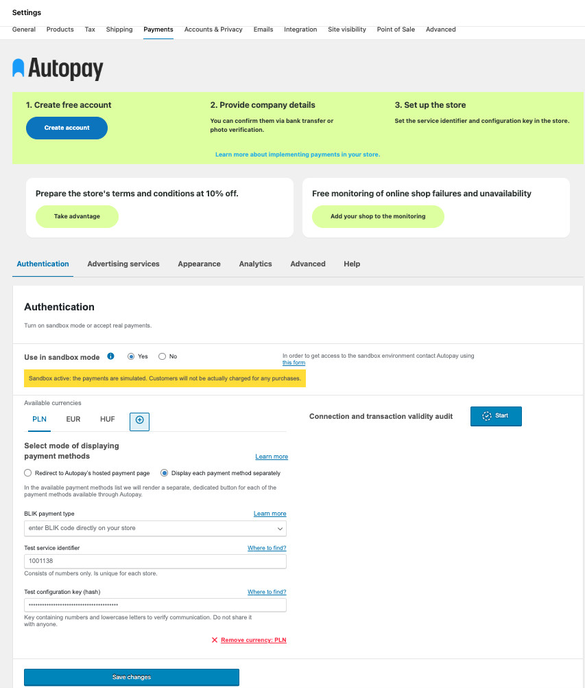
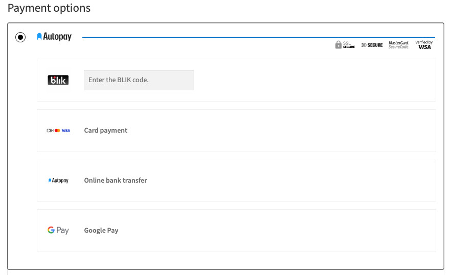

# Autopay payment gateway for WooCommerce

## Basic information

Autopay is a payment gateway for stores powered by WordPress and WooCommerce. Download the latest version from [GitHub Releases](https://github.com/bluepayment-plugin/autopay-payments/releases) or the official WordPress.org plugin directory.

## What does the Autopay payment plugin offer?

The Autopay plugin provides:

- popular payment methods in Poland and Europe:
  - online transfers ([Pay By Link](https://autopay.pl/baza-wiedzy/blog/ecommerce/platnosc-pay-by-link-na-czym-polega-i-co-mozesz-dzieki-niej-zyskac))
  - fast bank transfers
  - card payments, including an optional card entry form embedded directly in checkout (Autopay widget); additional bank authentication, such as 3DS, may require a redirect
  - [BLIK](https://autopay.pl/rozwiazania/blik)
  - Visa Mobile
  - [Google Pay](https://autopay.pl/rozwiazania/google-pay)
  - [Apple Pay](https://autopay.pl/rozwiazania/apple-pay)
  - instalment payments
  - recurring card payments for subscriptions
  - international payments
- guest checkout and checkout for registered customers
- classic WooCommerce checkout and Checkout Blocks
- redirect-based and on-site payments for selected methods, including cards and BLIK
- a test environment for verifying the installation and configuration
- deferred and instalment payments
- native Google Analytics 4 integration
- automatic validation of the Autopay credentials entered in the plugin
- multilingual support - automatic adaptation to the store language (PL, EN, DE, IT, ES), with English used as the fallback
- manual ordering of Autopay payment methods by drag and drop in WooCommerce settings
- native integration with the [Flexible Subscriptions](https://wordpress.org/plugins/flexible-subscriptions/) WooCommerce extension by WP Desk - card payments for subscription products, automatic renewals, manual payment of overdue renewals, and payment-instrument deactivation after subscription cancellation

[Register your shop!](https://autopay.pl/oferta/platnosci-online?utm_campaign=woocommerce&utm_source=woocommerce_description&utm_medium=offer_cta#kalkulator)

## Installation

### Requirements

- WordPress - tested on versions `6.0` to `7.1`
- WooCommerce - tested on versions `7.9.0` to `11.0`
- PHP `7.4` or later
- optional: [Flexible Subscriptions](https://wordpress.org/plugins/flexible-subscriptions/) - required only for subscription products with recurring card payments

### Download from WordPress.org

The WordPress.org directory contains several official and unofficial Autopay integrations. The plugin maintained directly by Autopay is available in the [WordPress plugin directory](https://wordpress.org/plugins/platnosci-online-blue-media/).

## Plugin configuration

Log in to WordPress and go to **WooCommerce → Settings → Payments**. Find **Autopay** and select **Manage** or **Configure**. You can also enable or disable the gateway from the payment methods list.

If you encounter a problem during installation or configuration, see the [FAQ](https://developers.autopay.pl/online/wtyczki/woocommerce#najcz%C4%99%C5%9Bciej-zadawane-pytania).

### Authentication

Use the **Authentication** tab to enter the credentials assigned to your Autopay service and select the environment used by the plugin.

1. **Test environment**
   - **Yes** - the plugin uses the test environment. Transactions are simulated: the customer is not charged and the merchant does not receive funds. Do not fulfil orders paid in this mode.
   - **No** - the plugin uses the production environment. Transactions result in real charges and settlements.
2. **Service ID** - the ServiceID assigned to your Autopay service. You can find it in the Autopay portal under **Service settings → Technical configuration**.
3. **Configuration key (hash)** - the key assigned to the service and used to sign communication. It is available in the same technical configuration section.

> **Important:** test and production environments use different ServiceIDs and configuration keys. If you do not have access to the test environment, [request it from Autopay](https://developers.autopay.pl/kontakt?utm_campaign=help&utm_source=woocommerce_documentation&utm_medium=text_link). Select the verification category and include the ServiceID of your existing service.

### Transaction status notifications

Autopay reports transaction status changes through ITN (Instant Transaction Notification) messages. The plugin uses them to update the payment and order status in WooCommerce. If Autopay cannot reach the store or the store does not return a valid response, an order may remain pending even after the payment has completed successfully.

### Recurring card payments for subscriptions (Flexible Subscriptions integration)

As of version `5.1.0`, the Autopay plugin integrates with the [Flexible Subscriptions](https://wordpress.org/plugins/flexible-subscriptions/) (WP Desk) WooCommerce extension, enabling card payments for subscription products with automatic renewal.

The integration supports both the classic WooCommerce checkout and Checkout Blocks.

**How it works:**
- On the first purchase, the customer selects recurring card payment (channel 1503) and is redirected to the activation form hosted by Autopay. This is separate from the channel 1500 card widget.
- After a successful activation, Autopay sends an RPAN notification containing a `ClientHash`. The plugin stores it on the corresponding Flexible Subscriptions subscription. WordPress does not store the card number or other card details.
- Subsequent renewal orders are charged automatically using the `ClientHash` and the total of the specific renewal order.
- An overdue renewal order can also be paid manually. If the stored instrument is active, the plugin uses it; otherwise, the order can be paid like an ordinary one-off order.
- Putting a subscription on hold stops future renewals from being scheduled, and reactivating it restores the schedule. Cancelling a subscription requests deactivation of its recurring payment instrument in Autopay.

**How to enable it:**
1. Make sure that recurring card payment channel 1503 is available in Autopay for the ServiceID and currency in use.
2. Install and configure Flexible Subscriptions and create a subscription product.
3. In the Autopay settings, open the **Authentication** tab and set **"Recurring card payments for subscriptions"** to **"Yes"** (`bm_recurring_card_enabled`, disabled by default).

> **Note:** this option only controls whether recurring card payment is offered for **new** subscription purchases. Disabling it does not stop active subscriptions or prevent their renewals and deactivation from being processed.

**Supported scope:**
- A cart may contain **one distinct subscription billing plan**, optionally together with one-off products (a mixed cart). The initial payment uses the full order total, while subsequent renewals use only the total of the renewal order generated by Flexible Subscriptions.
- The number of products or line items does not determine the number of plans. Multiple products may belong to one plan when Flexible Subscriptions groups them under the same schedule.
- A cart containing more than one distinct subscription plan or schedule is not supported. Payment through Autopay is blocked and the customer sees an appropriate message.
- The initial payment total must be greater than zero. A free trial without an initial fee cannot be activated through this integration.
- The integration supports Flexible Subscriptions and recurring card payments. It does not support WooCommerce Subscriptions or BLIK Recurring.

**Developer notes:**
- Activation uses `GatewayID=1503` and `RecurringAction=INIT_WITH_PAYMENT`. The pretransaction response provides the redirect URL for the activation form hosted by Autopay.
- RPAN associates the `ClientHash` with the subscription, ITN updates the transaction result, and RPDN confirms external instrument deactivation.
- Automatic renewals use `RecurringAction=AUTO`; a manual charge using the stored instrument uses `RecurringAction=MANUAL`.
- Each charge attempt receives its own `OrderID` in the `<renewal_order_id>-<attempt_number>` format. This associates the response and ITN with the correct renewal order and distinguishes a retry from the next billing period.
- Integration diagnostics are written to the WooCommerce `bm_woocommerce_recurring` log when the gateway's existing debug mode is enabled.

### Payment settings

The plugin supports two ways of presenting payment methods:

- **Redirect to the Autopay payment page** - checkout displays a single Autopay option. After placing the order, the customer is redirected to an Autopay-hosted page and selects one of the methods available for the service and currency.
- **Display each available method separately** - checkout displays a separate option for every available method. Depending on the selected method and its configuration, the customer either completes the payment in the store or is redirected to the appropriate payment page.

Additional settings:

- **BLIK payment mode** - available when payment methods are displayed separately:
  - **Redirect to the BLIK page** - the customer enters and confirms the BLIK code on the Autopay-hosted page. If supported, the customer can also remember the store on the current device.
  - **Enter the BLIK code directly in the store** - the customer enters the code in checkout without leaving the store.
- **Google Pay payment mode** - available when payment methods are displayed separately:
  - **Redirect to Google Pay** - the customer is redirected to the Google Pay payment page.
  - **Pay with Google Pay directly in the store** - the customer completes the payment without leaving checkout.
- **Order statuses** - separate settings determine the WooCommerce status assigned when a payment starts, succeeds, succeeds for an order containing only virtual products, or fails.
- **Payment method order** - when methods are displayed separately, you can arrange them by drag and drop in the Autopay payment settings.
- **Autopay logo in checkout** - choose a dark logo for a light background or a light logo for a dark background.

### Analytics
The plugin can send e-commerce events directly to Google Analytics 4. This integration is optional and is not required to process payments.

> **Note:** by default, the `purchase` event is sent when the order reaches the `Completed` status. You can change the triggering status in the **Order status triggering the "Purchase" event** setting.

The following events are supported:

| Event name | Event key | Description |
|---|---|---|
| Display product list | `view_item_list` | Sent for products visible in a product list. |
| View product details | `view_item` | Sent when a product page is opened. |
| Add product to cart | `add_to_cart` | Sent when a product is added to the cart. |
| Remove product from cart | `remove_from_cart` | Sent when a product is removed from the cart. |
| Start checkout | `begin_checkout` | Sent when the customer proceeds to checkout. |
| Complete order details | `set_checkout_option` | Sent after the customer completes the order details. |
| Select payment method | `checkout_progress` | Sent when the customer proceeds to payment method selection. |
| Complete transaction | `purchase` | Sent server-side after a successful transaction, even if the customer does not return to the thank-you page. |

To connect Google Analytics 4, enter the following values in the plugin settings:

- **Measurement ID** - in Google Analytics, open **Admin → Data streams**, select the web data stream, and copy the ID displayed in its details, for example `G-QCX4K9GSPC`.
- **Data stream ID** - available in the details of the selected data stream.
- **API secret** - in the selected data stream, open the **Measurement Protocol API secrets** section and create a secret for this integration.

### Advanced settings

These settings are intended mainly for diagnostics and compatibility troubleshooting. Leave them unchanged unless a specific integration requires them or Autopay support asks you to enable them.

- **Debug mode** - writes additional diagnostic information to WooCommerce logs. Enable it only while investigating a problem. Review logs before sharing them outside your organisation.
- **Logged-in administrator sandbox mode** - uses the Autopay test environment only for administrators logged in to the store. Other customers continue to use the production environment.
- **Show Autopay payment methods only to logged-in administrators** - hides Autopay methods from regular customers while keeping them available to administrators for verification.
- **Display a countdown screen before redirection** - adds an intermediate page before redirecting the customer. It can improve compatibility with analytics, courier, and other plugins that need additional time to process checkout events.
- **Compatibility mode for plugins that reload checkout fragments** - improves cooperation with extensions that dynamically refresh checkout sections.
- **Alternative production transaction start URL** - use only when Autopay has provided and approved a different production endpoint.
- **Alternative default order confirmation URL** - use only when a different return URL has been agreed with Autopay.
- **Custom CSS** - adds store-specific styles to the Autopay payment method list. Use carefully and verify both classic and block checkout after making changes.

## Frequently asked questions

### What are ITNs and how can I verify their configuration?

An ITN (Instant Transaction Notification) is a message sent by Autopay when a transaction status changes. The plugin uses ITNs to update the corresponding WooCommerce order, for example after the payment succeeds or fails.

The plugin checks communication automatically in the **Authentication** tab. You should also verify the return and ITN URLs in the Autopay administration portal.

In the [production portal](https://portal.autopay.eu/panel) or [test portal](https://testportal.autopay.eu/panel), configure:

1. Payment return URL: `{store URL}/?bm_gateway_return`, for example `https://my-shop.com/?bm_gateway_return`.
2. ITN URL: `{store URL}/?wc-api=wc_gateway_bluemedia`, for example `https://my-shop.com/?wc-api=wc_gateway_bluemedia`.

### Can only selected payment methods be switched on and off?

No. When Autopay payment methods are enabled, the plugin displays all methods available for the configured service, currency, and current checkout context.

### How do I enable BLIK 0 (entering the BLIK code directly on the shop page, without redirecting the payer to the BLIK page)?

Open the Autopay payment settings, select **Display each available method separately**, and then choose **Enter the BLIK code directly in the store** under **BLIK payment mode**.

### Can another currency be added?

Yes. The plugin supports currencies other than PLN, but every currency must also be enabled for your Autopay service and may require separate credentials. You can verify supported currencies in the service configuration in the [Autopay portal](https://portal.autopay.eu/panel). To enable another currency, contact Autopay using the [contact form](https://developers.autopay.pl/kontakt).

### How do I order refunds (from the shop or the Autopay portal)?

Refunds must currently be initiated in the [Autopay portal](https://portal.autopay.eu/panel). Open **Transactions**, select the transaction, and choose **Order a refund**.

### Can whitelabel mode display only BLIK?

No. The plugin supports two presentation modes:

- all available methods displayed separately in checkout, including BLIK; or
- one Autopay option that redirects the customer to the hosted payment page, where all available methods are shown.

### What should I do if no payment methods are available for the selected currency?

No payment method is available for the selected currency and service configuration. Verify the credentials and currency assigned to the service. If the configuration appears correct, contact Autopay using the [contact form](https://developers.autopay.pl/kontakt).

### Does the plugin support multiple languages and how can they be configured?

Yes. The plugin uses the language configured in WordPress/WooCommerce. Translations are available in Polish, English, German, Italian, and Spanish. For other languages, the interface falls back to English. No additional configuration is required.

### How do I change the order of Autopay payment methods in the store?

Open **WooCommerce → Settings → Payments → Autopay** and arrange the methods by drag and drop. This setting applies when payment methods are displayed separately.

### Can I pay by card for several different subscription plans in one cart?

No. If the cart contains more than one distinct Flexible Subscriptions plan or schedule, payment through Autopay is blocked. One billing plan is supported, optionally together with one-off products. The restriction applies to the number of distinct schedules, not simply to the number of products or line items in the cart.

## Screenshots

<figure>
  
  <figcaption>View of the fields to be completed</figcaption>
</figure>

<figure>
  
  <figcaption>Payment methods available</figcaption>
</figure>
