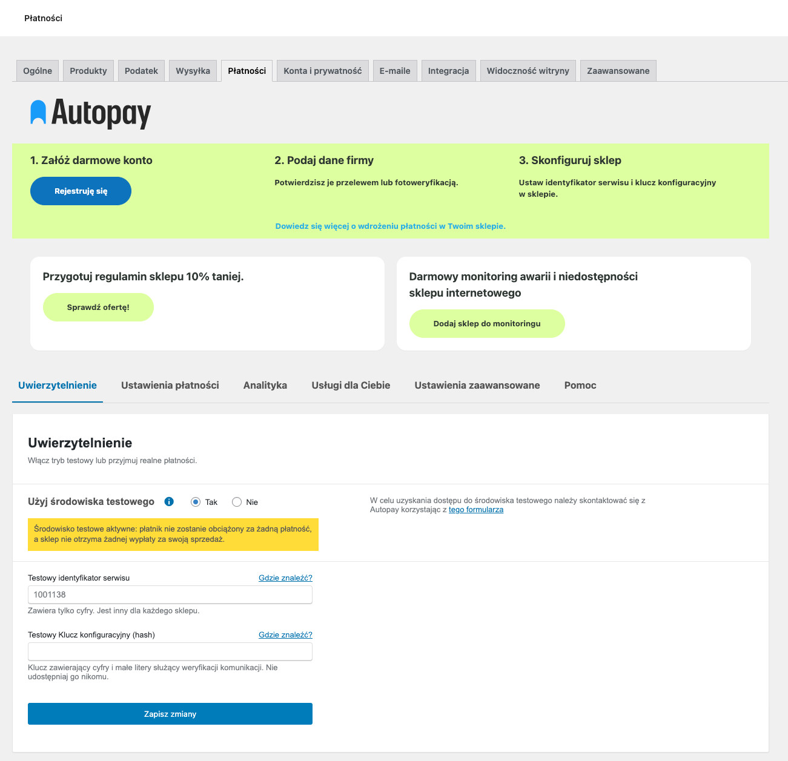
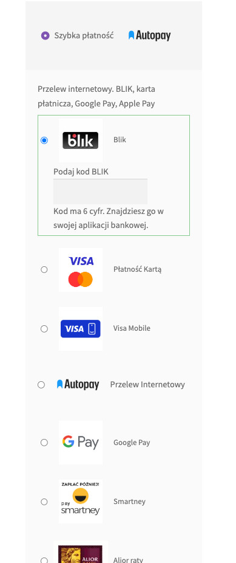

### Autopay to moduł płatności umożliwiający realizację transakcji bezgotówkowych w sklepie opartym na platformie WordPress (WooCommerce). Jeżeli jeszcze nie masz wtyczki, możesz ją pobrać [tutaj](https://github.com/bluepayment-plugin/autopay-payments/releases).

### Wtyczka płatnicza Autopay oferuje szereg funkcjonalności wspierających sprzedaż na Twoim sklepie:

- Najpopularniejsze metody płatności w Polsce i Europie
	- Przelewy online ([Pay By Link](https://autopay.pl/baza-wiedzy/blog/ecommerce/platnosc-pay-by-link-na-czym-polega-i-co-mozesz-dzieki-niej-zyskac))
	- Szybkie przelewy bankowe
	- [BLIK](https://autopay.pl/rozwiazania/blik)
	- Visa Mobile
	- [Google Pay](https://autopay.pl/rozwiazania/google-pay)
	- [Apple Pay](https://autopay.pl/rozwiazania/apple-pay)
	- Płatności ratalne
	- Płatności cykliczne
	- Płatności zagraniczne
- Najpopularniejsze sposoby sprzedaży dla platformy WooCommerce
- kup jako gość / kup jak zarejestrowany użytkownik
- checkout krokowy lub checkout blokowy
- przetwarzanie płatności z przekierowaniem do zewnętrznej strony płatności lub pozostając bezpośrednio na sklepie (wybrane metody: karty, BLIK)
- wsparcie środowiska testowego (realizacja testowych transakcji w celu poprawnej instalacji i konfiguracji wtyczki)
- płatności odroczone i ratalne
- natywna integracja z Google Analytics 4 z poziomu wtyczki płatniczej Autopay
- automatyczna weryfikacja poprawności konfiguracji danych autoryzacyjnych we wtyczce

[Zarejestruj swój sklep!](https://autopay.pl/oferta/platnosci-online?utm_campaign=woocommerce&utm_source=woocommerce_description&utm_medium=offer_cta#kalkulator)

## Wymagania

- WordPress – przetestowane na wersjach od 6.0 do 6.6.2
- Wtyczka WooCommerce – przetestowano na wersjach od 8.1 do 9.3.3
- PHP minimum 7.4

## Instalacja modułu

### Zainstaluj wtyczkę w panelu administracyjnym Wordpress:

1. Pobierz wtyczkę
2. Przejdź do zakładki Wtyczki > Dodaj nową a następnie wskaż pobrany plik instalacyjny.
3. Po zainstalowaniu wtyczki włącz moduł.
1. Przejdź do zakładki WooCommerce ➝ Ustawienia ➝ Płatności.
2. Wybierz Autopay, żeby przejść do konfiguracji.

### Skonfiguruj wtyczkę
Zaloguj się do panelu i przejdź do zakładki **Płatności** i odnajdź metodę **Autopay**. Wybierz **Konfiguruj**, by rozpocząć konfigurację wtyczki. Lub zaznacz odpowiednią opcję na przełączniku, by **włączyć** / **wyłączyć** działanie wtyczki na sklepie.

Jeżeli spotkałeś się z jakimś problemem podczas instalacji wtyczki odwiedź naszą [sekcję FAQ](#najczesciej-zadawane-pytania).

## Uwierzytelnianie

Zakładka "Uwierzytelnianie" umożliwi Ci wprowadzenie danych dostępowych Twojego konta w Autopay do wtyczki, a także ustalenie, czy płatności Autopay mają działać na środowisku testowym czy produkcyjnym.
1. **Środowisko testowe**
	- ustawione na **tak** - Służy do przetestowania integracji i konfiguracji wtyczki Autopay na Twoim sklepie. Na środowisku testowym płatnik nie zostanie obciążony za żaden zakup, a Ty nie otrzymasz wpłaty za żadną sprzedaż. Transakcje będą jedynie wirtualne. Pamiętaj, aby nigdy nie wysyłać transakcji za transakcje opłacone w trybie testowym!
	- ustawione na **nie** - Wtyczka działa na środowisku produkcyjnym. Innymi słowy, transakcje i płatności odbywają się naprawdę. Płatnik zostaje obciążony finansowo za zaku, a sprzedawca otrzymuje środki od Autopay za prowadzoną sprzedaż.
2. **Identyfikator serwisu** - Jest to identyfikator Twojego konta Autopay. Znajdziesz go po zalogowaniu się na swoje konto, wybierz z menu "Ustawienia serwisu" a następnie dla sekcji "Konfiguracja techniczna serwisu" kliknij na guzik "Wybierz". ID serwisu to wartość "Identyfikatora serwisu"
3. **Klucz konfiguracyjny (hash)** - Jest to wartość dedykowana dla Twojej strony na Twoim koncie Autopay. Znajdziesz go po zalogowaniu się na swoje konto, wybierz z menu "**Ustawienia serwisu**", a następnie dla sekcji "Konfiguracja techniczna serwisu" kliknij na guzik "Wybierz". Podpisany jest jako Klucz konfiguracyjny (hash)
> Środowisko testowe a Identyfikator serwisu i Klucz konfiguracyjny (hash)
Wartości Identyfikatora serwisu oraz Klucza konfiguracyjnego są różne dla środowiska testowego i produkcyjnego. Jeżeli założyłeś nowe konto Autopay i nie masz jeszcze dostępu do środowiska testowego możesz je uzyskać [wysyłając prośbę o dostęp](https://developers.autopay.pl/kontakt?utm_campaign=help&utm_source=woocommerce_documentation&utm_medium=text_link).
>
> Wybierz kategorię weryfikacje, uzupełnij dane, a w treści wiadomości podaj id swojego obecnego serwisu i poproś o utworzenie środowiska testowego dla Twojego sklepu.

## Zrzuty ekranu

<figure>
  
  <figcaption>Widok pól do uzupełnienia</figcaption>
</figure>

<figure>
  
  <figcaption>Dostępne metody płatności</figcaption>
</figure>
