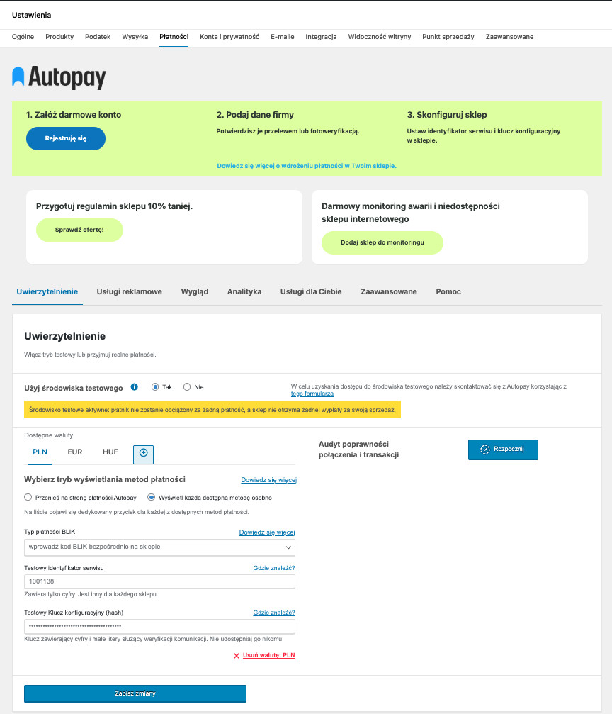
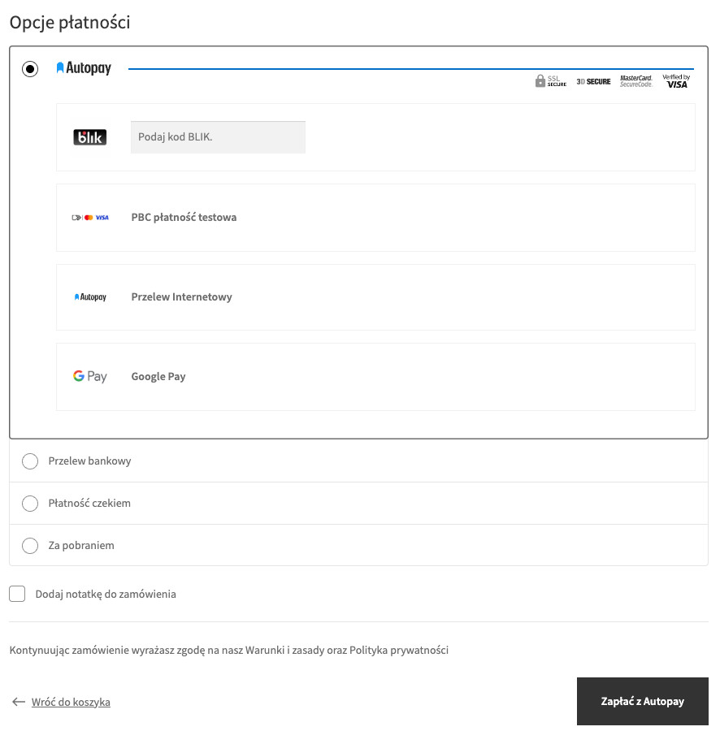

# Bramka płatności Autopay dla WooCommerce

## Podstawowe informacje

Autopay to bramka płatnicza dla sklepów opartych na WordPressie i WooCommerce. Najnowszą wersję wtyczki możesz pobrać z [GitHub Releases](https://github.com/bluepayment-plugin/autopay-payments/releases) lub z oficjalnego katalogu WordPress.org.

## Co oferuje wtyczka płatnicza Autopay?

Wtyczka Autopay oferuje między innymi:

- najpopularniejsze metody płatności w Polsce i Europie:
  - przelewy online ([Pay By Link](https://autopay.pl/baza-wiedzy/blog/ecommerce/platnosc-pay-by-link-na-czym-polega-i-co-mozesz-dzieki-niej-zyskac))
  - szybkie przelewy bankowe
  - karty płatnicze, w tym opcjonalny formularz karty wbudowany bezpośrednio w checkout (widżet Autopay); dodatkowa autoryzacja bankowa, np. 3DS, może wymagać przekierowania
  - [BLIK](https://autopay.pl/rozwiazania/blik)
  - Visa Mobile
  - [Google Pay](https://autopay.pl/rozwiazania/google-pay)
  - [Apple Pay](https://autopay.pl/rozwiazania/apple-pay)
  - płatności ratalne
  - cykliczne płatności kartą dla subskrypcji
  - płatności zagraniczne
- obsługę zakupów bez rejestracji oraz przez zalogowanych klientów
- obsługę klasycznego i blokowego checkoutu WooCommerce
- płatności z przekierowaniem oraz płatności realizowane bezpośrednio w sklepie dla wybranych metod, między innymi kart i BLIK-a
- środowisko testowe do weryfikacji instalacji i konfiguracji
- płatności odroczone i ratalne
- natywna integracja z Google Analytics 4
- automatyczna weryfikacja danych uwierzytelniających Autopay wprowadzonych we wtyczce
- wielojęzyczność - automatyczne dopasowanie do języka sklepu (PL, EN, DE, IT, ES), a w przypadku innych języków interfejs w języku angielskim
- ręczne ustawianie kolejności metod płatności Autopay metodą drag & drop w panelu WooCommerce
- natywna integracja z wtyczką [Flexible Subscriptions](https://wordpress.org/plugins/flexible-subscriptions/) (WP Desk) dla WooCommerce - płatności kartą za produkty subskrypcyjne, automatyczne odnowienia, ręczna zapłata za zaległe odnowienie oraz dezaktywacja instrumentu płatniczego po anulowaniu subskrypcji

[Zarejestruj swój sklep!](https://autopay.pl/oferta/platnosci-online?utm_campaign=woocommerce&utm_source=woocommerce_description&utm_medium=offer_cta#kalkulator)

## Instalacja

### Wymagania

- WordPress - przetestowane na wersjach od `6.0` do `7.1`
- WooCommerce - przetestowane na wersjach od `7.9.0` do `11.0`
- PHP `7.4` lub nowszy
- opcjonalnie: [Flexible Subscriptions](https://wordpress.org/plugins/flexible-subscriptions/) - wymagane wyłącznie do obsługi produktów subskrypcyjnych z cyklicznymi płatnościami kartą

### Pobierz z WordPress.org

W katalogu WordPress.org znajdują się różne oficjalne i nieoficjalne integracje z Autopay. Wtyczkę rozwijaną bezpośrednio przez Autopay znajdziesz w [oficjalnym katalogu WordPress](https://pl.wordpress.org/plugins/platnosci-online-blue-media/).

## Konfiguracja wtyczki

Zaloguj się do panelu WordPressa i przejdź do **WooCommerce → Ustawienia → Płatności**. Znajdź metodę **Autopay**, a następnie wybierz **Konfiguruj**. Na liście metod płatności możesz również włączyć lub wyłączyć bramkę Autopay.

Jeżeli podczas instalacji lub konfiguracji pojawi się problem, sprawdź [sekcję FAQ](https://developers.autopay.pl/online/wtyczki/woocommerce#najcz%C4%99%C5%9Bciej-zadawane-pytania).

### Uwierzytelnianie

W zakładce **Uwierzytelnianie** wprowadź dane dostępowe do serwisu Autopay i wybierz środowisko, z którym ma komunikować się wtyczka.

1. **Środowisko testowe**
   - **Tak** - wtyczka korzysta ze środowiska testowego. Transakcje są symulowane: klient nie jest obciążany, a sprzedawca nie otrzymuje środków. Zamówień opłaconych w tym trybie nie należy realizować.
   - **Nie** - wtyczka korzysta ze środowiska produkcyjnego. Transakcje powodują rzeczywiste obciążenia i rozliczenia.
2. **Identyfikator serwisu** - identyfikator ServiceID przypisany do serwisu Autopay. Znajdziesz go w portalu Autopay w sekcji **Ustawienia serwisu → Konfiguracja techniczna serwisu**.
3. **Klucz konfiguracyjny (hash)** - klucz przypisany do danego serwisu, używany do podpisywania komunikacji. Znajdziesz go w tej samej sekcji konfiguracji technicznej.

> **Ważne:** środowiska testowe i produkcyjne korzystają z różnych identyfikatorów serwisu oraz kluczy konfiguracyjnych. Jeżeli nie masz dostępu do środowiska testowego, [wyślij prośbę o jego utworzenie](https://developers.autopay.pl/kontakt?utm_campaign=help&utm_source=woocommerce_documentation&utm_medium=text_link). W zgłoszeniu wybierz kategorię dotyczącą weryfikacji i podaj identyfikator istniejącego serwisu.

### Powiadomienia o statusie transakcji

Autopay przekazuje zmiany statusu transakcji za pomocą komunikatów ITN (Instant Transaction Notification). Na ich podstawie wtyczka aktualizuje płatność i status zamówienia w WooCommerce. Jeżeli Autopay nie może połączyć się ze sklepem albo sklep nie odpowiada prawidłowo, zamówienie może pozostać w statusie oczekującym mimo poprawnego zakończenia płatności.

### Płatności cykliczne dla subskrypcji (integracja z Flexible Subscriptions)

Od wersji `5.1.0` wtyczka Autopay integruje się z wtyczką [Flexible Subscriptions](https://wordpress.org/plugins/flexible-subscriptions/) (WP Desk) dla WooCommerce, umożliwiając opłacanie produktów subskrypcyjnych kartą z automatycznym odnawianiem płatności.

Integracja działa w klasycznym checkoucie oraz w checkoucie blokowym WooCommerce.

**Jak to działa:**
- Przy pierwszym zakupie klient wybiera cykliczną płatność kartą (kanał 1503), a następnie zostaje przekierowany do hostowanego przez Autopay formularza aktywacji. Nie jest to widżet kartowy kanału 1500.
- Po poprawnej aktywacji Autopay przesyła komunikat RPAN z identyfikatorem `ClientHash`. Wtyczka zapisuje go przy konkretnej subskrypcji Flexible Subscriptions. WordPress nie przechowuje numeru karty ani innych danych karty.
- Kolejne zamówienia odnowieniowe są obciążane automatycznie na podstawie `ClientHash` i kwoty danego zamówienia odnowieniowego.
- Zaległe zamówienie odnowieniowe można opłacić ręcznie. Jeżeli zapisany instrument jest aktywny, wtyczka korzysta z niego; jeżeli nie jest dostępny, zamówienie można opłacić jak zwykłe zamówienie jednorazowe.
- Wstrzymanie subskrypcji zatrzymuje planowanie kolejnych odnowień, a wznowienie przywraca harmonogram. Anulowanie subskrypcji zleca dezaktywację powiązanego instrumentu recurring w Autopay.

**Jak włączyć:**
1. Upewnij się, że dla używanego ServiceID i waluty po stronie Autopay jest dostępny kanał płatności cyklicznej kartą 1503.
2. Zainstaluj i skonfiguruj wtyczkę Flexible Subscriptions oraz utwórz w niej produkt subskrypcyjny.
3. W ustawieniach Autopay przejdź do zakładki **Uwierzytelnianie**, ustaw opcję **"Cykliczne płatności kartą za subskrypcje"** na **"Tak"** (`bm_recurring_card_enabled`, domyślnie wyłączona).

> **Uwaga:** ta opcja kontroluje wyłącznie oferowanie cyklicznej płatności kartą przy **nowych** zakupach subskrypcji. Jej wyłączenie nie zatrzymuje już aktywnych subskrypcji i nie blokuje obsługi ich odnowień ani dezaktywacji.

**Obsługiwany zakres:**
- Obsługiwany jest **jeden odrębny plan rozliczeniowy subskrypcji** w koszyku, opcjonalnie razem z produktami jednorazowymi (mixed cart). Pierwsza płatność obejmuje pełną kwotę zamówienia, natomiast kolejne odnowienia obejmują wyłącznie kwotę zamówienia odnowieniowego utworzonego przez Flexible Subscriptions.
- Liczba produktów lub pozycji nie wyznacza liczby planów. Kilka produktów może należeć do jednego planu, jeżeli Flexible Subscriptions grupuje je według tego samego harmonogramu.
- Koszyk zawierający więcej niż jeden odrębny plan lub harmonogram subskrypcji nie jest obsługiwany. Płatność przez Autopay zostanie zablokowana, a klient zobaczy odpowiedni komunikat.
- Pierwsza płatność musi mieć kwotę większą od zera. Sam okres próbny bez opłaty początkowej nie może zostać aktywowany tą integracją.
- Integracja dotyczy Flexible Subscriptions i cyklicznych płatności kartą. Nie obejmuje WooCommerce Subscriptions ani BLIK Recurring.

**Informacje dla deweloperów:**
- Aktywacja korzysta z `GatewayID=1503` i `RecurringAction=INIT_WITH_PAYMENT`. Odpowiedź przedtransakcji dostarcza adres przekierowania do formularza aktywacyjnego Autopay.
- RPAN wiąże `ClientHash` z subskrypcją, ITN aktualizuje wynik transakcji, a RPDN potwierdza zewnętrzną dezaktywację instrumentu.
- Automatyczne odnowienie używa `RecurringAction=AUTO`, a ręczna zapłata zapisanym instrumentem - `RecurringAction=MANUAL`.
- Każda próba obciążenia otrzymuje własny `OrderID` w formacie `<renewal_order_id>-<attempt_number>`, co pozwala powiązać odpowiedź i ITN z właściwym zamówieniem oraz odróżnić ponowienie od kolejnego okresu rozliczeniowego.
- Diagnostyka integracji jest dostępna w logu WooCommerce `bm_woocommerce_recurring`, gdy włączony jest istniejący tryb debugowania bramki.

### Ustawienia płatności

Wtyczka udostępnia dwa sposoby prezentowania metod płatności:

- **Przenieś na stronę płatności Autopay** - w checkoucie wyświetlany jest jeden przycisk. Po jego wybraniu klient przechodzi na stronę Autopay, na której wybiera jedną z dostępnych metod płatności. Ten tryb najmniej ingeruje w wygląd i działanie checkoutu.
- **Wyświetl każdą dostępną metodę osobno** - w checkoucie wyświetlane są osobne pozycje dla metod dostępnych dla danego serwisu i waluty. Dalszy przebieg płatności zależy od wybranej metody i jej konfiguracji.

Dodatkowe ustawienia:

- **Tryb płatności BLIK** - dostępny przy osobnym wyświetlaniu metod:
  - **Przenieś na stronę BLIK** - klient podaje kod i zatwierdza płatność na stronie BLIK. Może również zapamiętać sklep na używanym urządzeniu, aby przy kolejnych płatnościach szybciej przejść do zatwierdzenia w aplikacji bankowej.
  - **Wprowadź kod BLIK bezpośrednio na sklepie** - pole na kod BLIK jest wyświetlane w checkoucie, bez przekierowania klienta przed rozpoczęciem płatności.
- **Tryb płatności Google Pay** - dostępny przy osobnym wyświetlaniu metod:
  - **Przekierowanie na stronę Google Pay** - klient kontynuuje płatność poza checkoutem sklepu.
  - **Płatność Google Pay bezpośrednio na sklepie** - klient płaci bez opuszczania checkoutu.
- **Statusy zamówień** - można wskazać status przypisywany po rozpoczęciu, zatwierdzeniu lub niepowodzeniu płatności. Osobne ustawienie jest dostępne dla zatwierdzonych zamówień zawierających wyłącznie produkty wirtualne.
- **Kolejność metod płatności** - metody Autopay można ułożyć metodą drag & drop w ustawieniach płatności WooCommerce. Zapisana kolejność jest używana w checkoucie.
- **Logo Autopay w checkoucie** - można wybrać ciemny wariant logo dla jasnego tła albo jasny wariant dla ciemnego tła.

### Analityka
Wtyczka może wysyłać zdarzenia e-commerce bezpośrednio do Google Analytics 4. Integracja jest opcjonalna i nie jest wymagana do obsługi płatności. Do jej uruchomienia potrzebne są dane strumienia Google Analytics.

> **Uwaga:** domyślnie zdarzenie `purchase` jest rejestrowane po osiągnięciu przez zamówienie statusu `Completed`. Status wyzwalający zdarzenie można zmienić w ustawieniu **Status zamówienia wyzwalający zdarzenie "Zakończenie transakcji"**.

Wtyczka obsługuje następujące zdarzenia:

| Nazwa zdarzenia | Klucz zdarzenia | Opis |
| --------------- | --------------- | ---- |
| Wyświetl produkt na liście | `view_item_list` | Wyzwalane dla każdego produktu, który znajduje się na liście i jest widoczny dla klienta podczas przeglądania strony. |
| Zobacz szczegóły produktu | `view_item` | Wyzwalane po otwarciu strony produktu. |
| Dodaj produkt do koszyka | `add_to_cart` | Wyzwalane po dodaniu produktu do koszyka. |
| Usuń produkt z koszyka | `remove_from_cart` | Wyzwalane, gdy użytkownik usunie produkt z koszyka. |
| Rozpocznij proces realizacji zamówienia | `begin_checkout` | Wyzwalane, gdy użytkownik przejdzie do kasy. |
| Wypełnione dane zamówienia | `set_checkout_option` | Wyzwalane po uzupełnieniu danych zamówienia. |
| Wybór metody płatności | `checkout_progress` | Wyzwalane po przejściu do kroku wyboru metody płatności. |
| Zakończenie transakcji | `purchase` | Wyzwalane po pomyślnym zakończeniu transakcji. Wysyłane jest po stronie serwera, by transakcja została oznaczona, nawet jeśli klient nie powrócił do strony z podziękowaniem. |

Do konfiguracji potrzebne są:

- **Identyfikator pomiaru**
  1. Zaloguj się do Google Analytics i otwórz sekcję **Administrator**.
  2. Przejdź do **Zbieranie i modyfikowanie danych → Strumienie danych**.
  3. Wybierz odpowiedni strumień danych.
  4. Skopiuj identyfikator pomiaru widoczny w prawym górnym rogu, np. `G-QCX4K9GSPC`.
- **Identyfikator strumienia danych**
  1. Otwórz szczegóły tego samego strumienia danych.
  2. Skopiuj wartość pola **Identyfikator strumienia**.
- **Tajny klucz API**
  1. Otwórz szczegóły strumienia danych.
  2. Przejdź do sekcji **Measurement Protocol**.
  3. Wybierz **Utwórz** i skopiuj wygenerowany klucz.

### Ustawienia zaawansowane

Ta sekcja zawiera ustawienia przeznaczone głównie do diagnostyki i rozwiązywania problemów. Jeżeli integracja działa poprawnie, zwykle nie trzeba ich zmieniać.

- **Tryb debugowania** - zapisuje szczegółowe informacje o działaniu wtyczki w logach WooCommerce. Włączaj go tymczasowo, najlepiej po konsultacji ze wsparciem technicznym Autopay. Przed przekazaniem logów upewnij się, że nie zawierają danych, których nie należy udostępniać.
- **Tryb Sandbox dla zalogowanego administratora** - zalogowany administrator korzysta z Autopay w trybie testowym, podczas gdy pozostali klienci nadal korzystają ze środowiska produkcyjnego.
- **Pokazuj metody płatności Autopay na sklepie tylko zalogowanym administratorom** - metody Autopay są widoczne wyłącznie dla zalogowanych administratorów. Pozostali klienci nie mogą z nich korzystać.
- **Wyświetl ekran odliczania przed przekierowaniem w celu zwiększenia kompatybilności** - dodaje ekran pośredni przed przekierowaniem. Może pomóc w przypadku konfliktów z innymi wtyczkami, np. integracjami analitycznymi lub kurierskimi.
- **Tryb kompatybilności z wtyczkami trzecimi, które przeładowują fragmenty checkoutu** - ponownie inicjalizuje elementy Autopay po przeładowaniu fragmentów checkoutu przez inną wtyczkę.
- **Alternatywny produkcyjny adres startu transakcji** - pozwala użyć innego adresu rozpoczęcia transakcji, jeżeli został on wcześniej uzgodniony z Autopay.
- **Zamień domyślny adres potwierdzenia zamówienia** - pozwala użyć innego adresu potwierdzenia transakcji, jeżeli został on wcześniej uzgodniony z Autopay.
- **Nadaj własne stylowanie CSS** - umożliwia dodanie własnych reguł CSS zmieniających wygląd listy metod Autopay. Z tej opcji może skorzystać deweloper sklepu lub pracownik wsparcia technicznego Autopay.

## Najczęściej zadawane pytania

### Czym są komunikaty ITN i jak sprawdzić ich konfigurację?

ITN (Instant Transaction Notification) to komunikat wysyłany przez Autopay po zmianie statusu transakcji. Dzięki niemu WooCommerce może między innymi oznaczyć zamówienie jako opłacone i uruchomić dalszą realizację.

Konfigurację ITN można sprawdzić automatycznym testem w zakładce **Uwierzytelnianie** oraz w portalu Autopay.

W [portalu produkcyjnym](https://portal.autopay.eu/panel) lub [portalu testowym](https://testportal.autopay.eu/panel) sprawdź następujące adresy:

- adres powrotu po płatności: `{URL Twojego sklepu}/?bm_gateway_return`, np. `https://moj-sklep.com/?bm_gateway_return`
- adres odbierający ITN: `{URL Twojego sklepu}/?wc-api=wc_gateway_bluemedia`, np. `https://moj-sklep.com/?wc-api=wc_gateway_bluemedia`

### Czy można włączać i wyłączać jedynie wybrane metody płatności?

Nie. Jeżeli Autopay jest włączone, wtyczka pobiera i wyświetla metody dostępne dla danego serwisu, waluty i bieżącego kontekstu zamówienia.

### Jak włączyć BLIK 0 (wpisanie kodu BLIK bezpośrednio na stronie sklepu, bez przekierowania płatnika na stronę BLIK)?

Aby włączyć BLIK 0, przejdź do ustawień płatności Autopay, wybierz tryb **Wyświetl każdą dostępną metodę osobno**, a następnie w polu **Tryb płatności BLIK** ustaw **Wprowadź kod BLIK bezpośrednio na sklepie**.

### Czy można dodać inną walutę?

Tak. Od wersji `4.1.26` wtyczka obsługuje waluty inne niż PLN. Każda waluta musi być jednak skonfigurowana również po stronie Autopay i może wymagać osobnych danych uwierzytelniających.

Obsługiwane waluty możesz sprawdzić w konfiguracji serwisu w [Portalu Autopay](https://portal.autopay.eu/panel). Aby dodać kolejną walutę, skontaktuj się z Autopay przez [formularz kontaktowy](https://developers.autopay.pl/kontakt).

### Jak zlecać zwroty (z poziomu sklepu czy portalu Autopay)?

Zwroty należy obecnie zlecać w [Portalu Autopay](https://portal.autopay.eu/panel). Otwórz zakładkę **Transakcje**, przejdź do szczegółów właściwej transakcji i wybierz **Zleć zwrot**.

### Czy w trybie whitelabel można wyświetlić wyłącznie BLIK?

Nie można wyświetlić wyłącznie BLIK-a i ukryć pozostałych metod udostępnionych dla serwisu. Wtyczka pozwala:

- wyświetlić osobno wszystkie dostępne metody, w tym BLIK, albo
- wyświetlić jeden zbiorczy przycisk, który prowadzi do strony Autopay z listą dostępnych metod.

### Co zrobić, gdy pojawia się komunikat o braku metod płatności dla wybranej waluty?

Dla wybranej waluty Autopay nie zwróciło żadnej dostępnej metody płatności. Skontaktuj się z Autopay przez [formularz kontaktowy](https://developers.autopay.pl/kontakt) i poproś o sprawdzenie konfiguracji serwisu.

### Czy wtyczka obsługuje różne języki i jak je skonfigurować?

Tak. Wtyczka automatycznie korzysta z języka ustawionego w WordPressie i WooCommerce. Dostępne są wersje polska, angielska, niemiecka, włoska i hiszpańska. Dla pozostałych języków używany jest angielski. Nie wymaga to dodatkowej konfiguracji.

### Jak zmienić kolejność metod płatności Autopay w sklepie?

W ustawieniach płatności Autopay przeciągnij metody za pomocą drag & drop i zapisz zmiany. Ta sama kolejność zostanie zastosowana w checkoucie.

### Czy da się opłacić kartą kilka różnych planów subskrypcji w jednym koszyku?

Nie. Jeżeli koszyk zawiera więcej niż jeden odrębny plan lub harmonogram Flexible Subscriptions, płatność przez Autopay zostanie zablokowana. Obsługiwany jest jeden plan rozliczeniowy, opcjonalnie razem z produktami jednorazowymi. Ograniczenie dotyczy liczby odrębnych harmonogramów, a nie samej liczby produktów lub pozycji w koszyku.

## Zrzuty ekranu

<figure>
  
  <figcaption>Widok pól do uzupełnienia</figcaption>
</figure>

<figure>
  
  <figcaption>Dostępne metody płatności</figcaption>
</figure>
